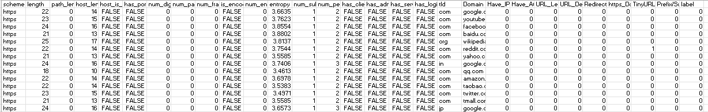
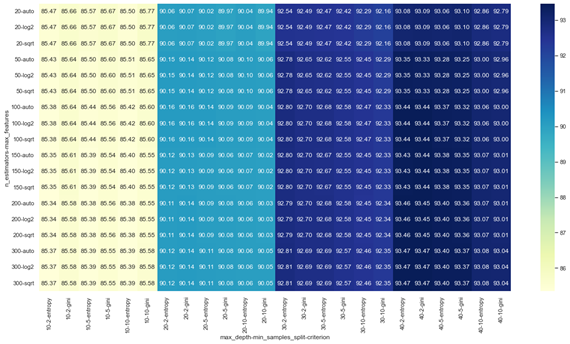

# My-Portfolio
Eden Rose Nate | Bicol University | BSCS 
# PROJECT 1: PhishCheck: A Browser-Based Extension for Phishing Attack Detection Using Machine Learning Approach <br />
## Project Overview
*Collected large dataset from multiple resources including Phishtank,OpenPhish and Kaggle.<br />
*Discovered the phishing anomaly using supervised algorithms such as Random Forest, SVM and XGBoost in terms of accuracy, precision, recall, f-measure and confusion matrix.<br />
*Identified the characteristics of phishing URLs.<br />
*Developed a browser-based extension that shall automatically categorize each URL as legitimate or phishing.

## Architectural Paradigm of the Study
This project used two important components to further understand the cycle: the PhishCheck Chrome extension, which serves as the front-end, and Python, which serves as the study's back-end. Front-end components such as pop-up window and background scripts are some of the important parts of chrome extensions that were navigated first when users visit a website or enter a url in the pop-up address bar. <br />


# Data Preparation
The study's data preparation is divided into two parts: data preprocessing and feature engineering.

## A. Data Preprocessing 
The researchers used Python programming which uses libraries such as numpy, pandas, matplotlib and seaborn for the data preprocessing. Initially, all of the data cleaning method was combined into a single piece of code. After reviewing the dataset, it was discovered that there were numerous errors, including additional white spaces, null values, unnecessary columns, and duplicates. To further clean the dataset, it was concluded that these noises must be removed at each stage. 

### Import the libraries and collected raw data for checking and data cleaning. 
```
import pandas as pd
import numpy as np
import seaborn as sns
import matplotlib.pyplot as plt

#import data
data = pd.read_csv(r"C:\Users\user\OneDrive\Desktop\Thesis1_Phishing\cleaned_finaldataset.csv")
data.head() 

#displays the raw dataset
sns.set_theme(style="whitegrid")
sns.countplot(x=data["label"])
```


*Based on the figure above, the raw dataset is composed of 594,907 URLs. A total of 345, 738 legitimate URLs were taken from Kaggle and labeled as 0 while 249, 169 phishing URLs labeled as 1 were taken from Phishtank, Openphish and Kaggle.*

```
#counts the values in label column 
data['label'].value_counts()

def initial_read(data):
    print('SHAPE')
    print(data.shape)
    print('=====')
    print('DTYPES')
    print(data.dtypes)
    print('=====')
    print('NULL VALUES')
    print(data.isnull().sum())
    print('=====')

#displays the dataframe
initial_read(data)

#replace missing data with the most frequent occurences 
data1 = data.fillna(data.mode().iloc[0])
data1.count

#check for and handle duplicates
data1.drop_duplicates(inplace=True)
```

### Exports the cleaned dataset 
```
#Saves the dataframe to CSV file
data1.to_csv(r'C:\Users\user\OneDrive\Desktop\Thesis1_Phishing\cleaned_finaldataset1.csv', index=False)
```

## B. Feature Engineering

Feature engineering or feature extraction is a process of dimensionality reduction where the researcher take a set of data and transform it into a set of features that are easier to work with. In other words, this is the process of selecting and transforming the most pertinent variables from raw data when developing a prediction model using statistical modeling or machine learning. 

```
from math import log
from re import compile
from urllib.parse import urlparse
from socket import gethostbyname
from requests import get
from json import dump
from string import ascii_lowercase
from numpy import array

class LexicalURLFeature:
    def __init__(self, url):
        self.description = 'blah'
        self.url = url
        self.urlparse = urlparse(self.url)
        self.host = self.__get_ip()

    def __get_entropy(self, text):
        text = text.lower()
        probs = [text.count(c) / len(text) for c in set(text)]
        entropy = -sum([p * log(p) / log(2.0) for p in probs])
        return entropy

    def __get_ip(self):
        try:
            ip = self.urlparse.netloc if self.url_host_is_ip() else gethostbyname(self.urlparse.netloc)
            return ip
        except:
            return None

    # extract lexical features
    def url_scheme(self):
        print(self.url)
        print(self.urlparse)
        return self.urlparse.scheme

    def url_length(self):
        return len(self.url)

    def url_path_length(self):
        return len(self.urlparse.path)

    def url_host_length(self):
        return len(self.urlparse.netloc)

    def url_host_is_ip(self):
        host = self.urlparse.netloc
        pattern = compile("^\d{1,3}\.\d{1,3}\.\d{1,3}\.\d{1,3}$")
        match = pattern.match(host)
        return match is not None

    def url_has_port_in_string(self):
        has_port = self.urlparse.netloc.split(':')
        return len(has_port) > 1 and has_port[-1].isdigit()

    def number_of_digits(self):
        digits = [i for i in self.url if i.isdigit()]
        return len(digits)

    def number_of_parameters(self):
        params = self.urlparse.query
        return 0 if params == '' else len(params.split('&'))

    def number_of_fragments(self):
        frags = self.urlparse.fragment
        return len(frags.split('#')) - 1 if frags == '' else 0

    def is_encoded(self):
        return '%' in self.url.lower()

    def num_encoded_char(self):
        encs = [i for i in self.url if i == '%']
        return len(encs)

    def url_string_entropy(self):
        return self.__get_entropy(self.url)

    def number_of_subdirectories(self):
        d = self.urlparse.path.split('/')
        return len(d)

    def number_of_periods(self):
        periods = [i for i in self.url if i == '.']
        return len(periods)

    def has_client_in_string(self):
        return 'client' in self.url.lower()

    def has_admin_in_string(self):
        return 'admin' in self.url.lower()

    def has_server_in_string(self):
        return 'server' in self.url.lower()

    def has_login_in_string(self):
        return 'login' in self.url.lower()
        
    def get_tld(self):
      return self.urlparse.netloc.split('.')[-1].split(':')[0]
import csv
import time

# Start the timer
start_time = time.time()

# read the csv dataset into a list of dictionaries
urls = []
with open(r"C:\Users\Ralph\Documents\BSCS-4B\Thesis\Feature Engineering\Dataset\Cleaned Data\Cleaned Dataset.csv", encoding='utf-8') as f:
    reader = csv.DictReader(f)
    for row in reader:
        urls.append(row)

# extract features from each URL
features = []
for url in urls:
    lexical_features = LexicalURLFeature(url['url'])
    url_features = {
        'scheme': lexical_features.url_scheme(),
        'length': lexical_features.url_length(),
        'path_length': lexical_features.url_path_length(),
        'host_length': lexical_features.url_host_length(),
        'host_is_ip': lexical_features.url_host_is_ip(),
        'has_port': lexical_features.url_has_port_in_string(),
        'num_digits': lexical_features.number_of_digits(),
        'num_params': lexical_features.number_of_parameters(),
        'num_frags': lexical_features.number_of_fragments(),
        'is_encoded': lexical_features.is_encoded(),
        'num_enc_chars': lexical_features.num_encoded_char(),
        'entropy': lexical_features.url_string_entropy(),
        'num_subdirs': lexical_features.number_of_subdirectories(),
        'num_periods': lexical_features.number_of_periods(),
        'has_client': lexical_features.has_client_in_string(),
        'has_admin': lexical_features.has_admin_in_string(),
        'has_server': lexical_features.has_server_in_string(),
        'has_login': lexical_features.has_login_in_string(),
        'tld': lexical_features.get_tld()
    }
    features.append(url_features)

# save the extracted features to a new csv file
fieldnames = ['scheme', 'length', 'path_length', 'host_length', 'host_is_ip', 'has_port', 'num_digits', 'num_params',
              'num_frags', 'is_encoded', 'num_enc_chars', 'entropy', 'num_subdirs', 'num_periods', 'has_client',
              'has_admin', 'has_server', 'has_login', 'tld']
with open('Dataset Features.csv', 'w', newline='') as f:
    writer = csv.DictWriter(f, fieldnames=fieldnames)
    writer.writeheader()
    for feature in features:
        writer.writerow(feature)

```
*The code outputs the 29 extracted features from the raw dataset which are used for model training.*



*Feature engineering stage was also divided into three types: URL-based features, Address bar based Feature and Lexical-based Feature. *

### URL-based Features
The features extracted from a URL are used to determine whether the URL is phishing or not. The quality of training data, and thus the quality of features fed into the model, determines the success of any learning effort. Thus, researchers must ensure that the extracted features represent or have the potential to identify the problem that they are attempting to model. The two sources of information used in extracting features are Address Bar based Features and Lexical based Features. 

### Address Bar based Features 
The address bar-based features are extracted from a URL inputted in the address bar and extracts the specific features of an URL based on its characteristics or structure. 

### Lexical-based Feature
These refer to statistical features extracted from the literal URL string. For example, length of the URL string, number of digits, and number of parameters in its query part, if the URL is encoded. (Ikwu, 2022). The following features presented below are the important extracted lexical-based features from the URL string which shall be used in the study.

# Modeling
This phase makes use of machine learning algorithms and various modeling techniques on data that has been processed and extracted in the data preparation phase in order to select, train, and test the most appropriate modeling techniques.

## Modeling Techniques
### A. Correlation-based Feature Selection
Feature selection is the process of selecting the most important features to input in machine learning algorithms. It is the process to automatically or manually select those features that contribute most to the prediction variable or output (Shaikh, 2018). 

```
# Perform feature selection using SelectKBest with mutual_info_classif as the scoring function
selector = SelectKBest(score_func=mutual_info_classif, k=20)  
X_selected = selector.fit_transform(X, y)

# Display the selected features with corresponding values
selected_features = X.columns[selector.get_support()]
selected_scores = selector.scores_[selector.get_support()]
feature_scores = pd.DataFrame({'Features': selected_features, 'Scores': selected_scores})
print(feature_scores)

# sort feature scores in descending order
feature_scores_sorted = feature_scores.sort_values('Scores', ascending=False)

# create bar plot of feature scores
plt.figure(figsize=(10, 8))
plt.barh(feature_scores_sorted['Features'], feature_scores_sorted['Scores'], color='blue')
plt.title('Feature Scores using CFS')
plt.xlabel('Score')
plt.ylabel('Feature')
plt.show()
```


*The k parameter is set to 20, which specifies that the top 20 features with the highest scores are selected. The fit_transform method fits the SelectKBest model to the data and transforms the input data to include only the selected features.*

### B. K-Fold Cross Validation 
Cross validation is a useful technique that determines how well the model performed, and it is always necessary to assess the model's accuracy to ensure that it was properly trained using the data and did not overfit or underfit. The most common cross-validation method is known as K-fold cross-validation, where a subset of the training data is used as the validation set. In k-fold cross validation, the dataset is divided into k groups or folds, and the model is trained on k-1 while the last one is kept for testing.

```
 Define the number of folds
n_folds = 10

# Split the dataset into training and testing sets using k-fold cross-validation
kf = KFold(n_splits=n_folds, shuffle=True, random_state=42)
```
*Additionally, 10-fold was selected to ensure that there’s no overfitting and bias in the dataset. Several folds were also applied in the model and the results showed 10 folds were the most accurate among other folds.*

 


### C. Resampling
Random resampling is a method used in data mining to solve the problem of imbalanced data. This method is used to create a new transformed version of balance distribution without ignoring the minority classes. This method is helpful when training data as it also prioritizes the importance of minority classes in prediction. 

*Two methods were used to execute resampling on the dataset. These are the undersampling and oversampling techniques.*

```
#Oversampling using SMOTE
ros = SMOTE(random_state=42)
X_train_resampled_o, y_train_resampled_o = ros.fit_resample(X_train, y_train)

#define the model
model_ros = RandomForestClassifier(random_state=42)

---------------------------------------------------------------------------------------------------------------------------------------------------------------
#Undersampling
rus = RandomUnderSampler(random_state=42)
X_train_resampled_u, y_train_resampled_u = rus.fit_resample(X_train, y_train)

#train and evaluate the model with RandomUnderSampler
model_rus = RandomForestClassifier(random_state=42)
```
*Combining the two sampling methods was also executed to balance the dataset and test if the model's performance increased.*

```
#Oversampling and Undersampling
#split the dataset into training and testing sets
X_train, X_test, y_train, y_test = train_test_split(X_selected, y, random_state=42, test_size=0.20) #70% training and 30% test

clf = RandomForestClassifier(random_state=42)
ros = SMOTE(sampling_strategy=0.8)
rus = RandomUnderSampler(sampling_strategy=0.9)

steps = [('over', ros), ('under', rus), ('model', clf)]
pipeline = Pipeline(steps=steps)

#perform k-fold cross-validation
cv_scores = cross_val_score(pipeline, X_selected, y, cv=10)

print("Cross-validation scores:", cv_scores)
print("Average cross-validation score:", cv_scores.mean())

#fit the pipeline on the training data
pipeline.fit(X_train, y_train)

#make predictions on the test data
y_pred = pipeline.predict(X_test)

#evaluate the performance of the pipeline
accuracy = accuracy_score(y_test, y_pred)
precision = precision_score(y_test, y_pred)
recall = recall_score(y_test, y_pred)
f1 = f1_score(y_test, y_pred)
print("Accuracy:", accuracy)
print("Precision:", precision)
print("Recall:", recall)
print("F1 score:", f1)

#count the total resampled data
counter_resampled = Counter(y_train)
print('After resampling:', counter_resampled)
```

### D. Model Optimization using Hyperparameter Tuning
To further improve the accuracy and performance of the machine learning model, hyperparameter tuning was applied on the most efficient algorithm. Hyperparameters are variables that are set before the training process begins and cannot be learned from the data.  Grid search is a popular technique used in machine learning to find the best hyperparameters for a model. The grid search technique involves defining a grid of possible values for each hyperparameter and training the model with each possible combination of hyperparameters. 

```
#Import libraries
import pandas as pd
import numpy as np
import matplotlib.pyplot as plt
import seaborn as sns
from sklearn.feature_selection import SelectKBest, mutual_info_classif
from sklearn.ensemble import RandomForestClassifier
from sklearn.model_selection import train_test_split, KFold, GridSearchCV
from sklearn.metrics import accuracy_score, precision_score, recall_score, f1_score

# Load the CSV file into a dataframe
df = pd.read_csv(r"C:\Users\user\OneDrive\Desktop\Thesis1_Phishing\Training\finaldataset.csv")
```
*In hyperparameter tuning, the correlation-based feature selection (CFS) were used to maximize the performance of the three model. CFS has shown significant increase on the performance of the model which makes used of 20 features which is applied in this stage.*

```
#Perform feature selection using SelectKBest with mutual_info_classif as the scoring function
selector = SelectKBest(score_func=mutual_info_classif, k=20)  
X_selected = selector.fit_transform(X, y)

#Display the selected features with corresponding values
selected_features = X.columns[selector.get_support()]
selected_scores = selector.scores_[selector.get_support()]
feature_scores = pd.DataFrame({'Features': selected_features, 'Scores': selected_scores})
print(feature_scores)

#split the dataset into training and testing sets
X_train, X_test, y_train, y_test = train_test_split(X_selected, y, random_state=42, test_size=0.20) #80% training and 20% test data

rf= RandomForestClassifier(random_state=42)

#define the grid search parameters
param_grid = {'n_estimators': [20, 50, 100, 150, 200, 300], 
              'max_features': ['auto', 'sqrt', 'log2'], 
              'max_depth': [10, 20, 30, 40], 
              'min_samples_split': [2, 5, 10],
              'criterion': ['gini', 'entropy']}

#perform k-fold cross validation and grid search
kf = KFold(n_splits=10, shuffle=True, random_state=42)
grid_search = GridSearchCV(rf, param_grid, cv=kf, scoring='accuracy')
grid_search.fit(X_train, y_train)

#plot the results
results = grid_search.cv_results_
params = results['params']
mean_scores = results['mean_test_score']

#print the best parameters and score
print("Best parameters: ", grid_search.best_params_)
print("Best score: ", grid_search.best_score_)

# make predictions using the best parameters
best_rf = grid_search.best_estimator_
y_pred = best_rf.predict(X_test)

#evaluate the performance of the model
accuracy = accuracy_score(y_test, y_pred)
precision = precision_score(y_test,y_pred)
recall = recall_score(y_test, y_pred)
f1 = f1_score(y_test, y_pred)

#print the results
print("Accuracy:", accuracy)
print("Precision:", precision)
print("Recall:", recall)
print("F1 score:", f1)

# Extract scores
scores = grid_search.cv_results_['mean_test_score']

# Create histogram
plt.hist(scores, bins=len(set(scores)), color='blue')
plt.xlabel('Accuracy')
plt.ylabel('Count')
plt.title('Grid Search Results')
plt.show()
```


```
#plot the heatmap
results = grid_search.cv_results_
df = pd.DataFrame.from_dict(results)
df = df[['param_n_estimators', 'param_max_features', 'param_max_depth', 'param_min_samples_split', 'param_criterion', 'mean_test_score']]
df = df.sort_values(by=['param_n_estimators', 'param_max_features', 'param_max_depth', 'param_min_samples_split', 'param_criterion'])
df['mean_test_score'] = df['mean_test_score'] * 100
df = df.rename(columns={'param_n_estimators': 'n_estimators', 'param_max_features': 'max_features', 'param_max_depth': 'max_depth', 'param_min_samples_split': 'min_samples_split', 'param_criterion': 'criterion'})

sns.set(rc={'figure.figsize':(20,10)})
sns.heatmap(df.pivot_table(index=['n_estimators', 'max_features'], columns=['max_depth', 'min_samples_split', 'criterion'], values='mean_test_score'), cmap='YlGnBu', annot=True, fmt='.2f')
```



# Model Performance Comparison and Visualization of Features
After completing the training process, the model generated a confusion matrix by utilizing the predicted labels of the test data and the true labels of the same data. A confusion matrix is a matrix of size N x N that helps to assess the effectiveness of a classification model. 

```
#Print the average scores across all folds
print("Average accuracy:", np.mean(accuracy_scores))
print("Average precision:", np.mean(precision_scores))
print("Average recall:", np.mean(recall_scores))
print("Average F1 score:", np.mean(f1_scores))

print(confusion_matrix(y_test, y_pred))

#displays the confusion matrix
skplt.metrics.plot_confusion_matrix(y_test, y_pred, cmap='Blues', normalize=False, title = 'Confusion Matrix')
```


### RANDOM FOREST 
*The model was tested on a dataset containing a total of 50,452 URLs. The evaluation revealed that the model was able to accurately predict 29,316 legitimate URLs as true positives and 17,953 phishing URLs as true negatives. However, there were 961 false positive predictions and 2,222 false negative predictions.
It can be concluded that the algorithm performed well in distinguishing between legitimate and phishing URLs. The high accuracy score of 93.78% indicates that the model was able to correctly predict the majority of the URLs. Moreover, the high precision score of 94.94%, recall score of 89.34%, and the f1-score of 92.05% indicates that the model had a moderate false negative rate, meaning that it was less successful in identifying legitimate URLs as legitimate.*

### XGBOOST 
*The XGBoost model, on the other hand, accurately predicted 29, 304 true positives and 16,883 true negatives correctly, with a total of 4,265 misclassifications consisting of false positives 973 and 3,292 false negatives. This led to the evaluation scores of the algorithm's performances which produced 91.71% accuracy, 94.61% precision, 84.25% recall and 89.13% f1-score.*

### SUPPORT VECTOR MACHINE 
*On the other hand, the SVM model accurately identified 28,932 legitimate classes as true positives (0) and 13,323 phishing classes as true negatives (1), it incorrectly classified 8,197 classes, including 1,345 false positives and 6,852 false negatives. As a result, the model's performance was evaluated, and it achieved an accuracy of 83.83%, a precision of 90.91%, a recall of 66.54%, and an f1-score of 76.84%.*

# Significant Features of Phishing URLs
The results show that the path length, URL Depth, Num_subdirs, num_params, entropy, length, num_digits, num_params, has_login, num_periods, URL_length, has_admin, host_length, Have_at, Prefix/Suffix, Redirection, num_enc_chars, has_client, TinyURL, host_is_ip, and has_server has the highest correlation among other features in the dataset. Thus, these features can be used to effectively and accurately predict phishing attempts with a high degree of confidence. 

*Only 4 features was also selected to analyze the results effectively with the use of visualizations.*

```
import pandas as pd
import matplotlib.pyplot as plt
import seaborn as sns
import matplotlib.pyplot as plt

# Load the CSV file into a dataframe
df = pd.read_csv(r"C:\Users\user\OneDrive\Desktop\Thesis1_Phishing\final dataset\finaldataset.csv")

#Heatmap for Feature Correlation
plt.figure(figsize=(4,10))
sns.heatmap(df.corr()[['label']].sort_values('label', ascending=False), annot=True);
# Show the plot
plt.show()

#1. PATH LENGTH 
# Plot the data for label 0 in blue
plt.plot(df.loc[df['label'] == 0, 'path_length'], label='Label 0', color='midnightblue')

#plot the data for label 1 in red
plt.plot(df.loc[df['label'] == 1, 'path_length'], label='Label 1', color='darkorange')

#add labels and title
plt.xlabel('Index')
plt.ylabel('path_length')
plt.title('path_length of URLs')

#add legend
plt.legend()

#show the plot
plt.show()

#find the maximum value in the column
max_val = df['path_length'].max()

print(max_val)  

#find the least value in the column
least_val = df['path_length'].min()
print(least_val)
```

```
#2. URL DEPTH AND NUMBER OF SUBDIRECTORIES
#plot the data for label 0 in blue
plt.plot(df.loc[df['label'] == 0, 'URL_Depth'], label='Label 0', color='midnightblue')

#plot the data for label 1 in red
plt.plot(df.loc[df['label'] == 1, 'URL_Depth'], label='Label 1', color='darkorange')

#add labels and title
plt.xlabel('Index')
plt.ylabel('URL_Depth')
plt.title('URL_Depth of URLs')

#add legend
plt.legend()

#show the plot
plt.show()
```


```
#3. ENTROPY
#plot the data for label 0 in blue
plt.plot(df.loc[df['label'] == 0, 'entropy'], label='Label 0', color='midnightblue')

#plot the data for label 1 in red
plt.plot(df.loc[df['label'] == 1, 'entropy'], label='Label 1', color='darkorange')

#add labels and title
plt.xlabel('Index')
plt.ylabel('entropy')
plt.title('entropy of URLs')

#add legend
plt.legend()

#show the plot
plt.show()

#find the maximum value in the column
max_val = df['entropy'].max()
print(max_val)  
```


```
#4. LENGTH
#plot the data for label 0 in blue
plt.plot(df.loc[df['label'] == 0, 'length'], label='Label 0', color='midnightblue')

#plot the data for label 1 in red
plt.plot(df.loc[df['label'] == 1, 'length'], label='Label 1', color='darkorange')

#add labels and title
plt.xlabel('Index')
plt.ylabel('length')
plt.title('length of URLs')

#add legend
plt.legend()

#show the plot
plt.show()

#find the maximum value in the column
max_val = df['length'].max()
print(max_val)  

#find the least value in the column
least_val = df['length'].min()
print(least_val)
```


### Conclusion 
*The results of the experiments show that combining K-fold Cross Validation and Correlation-based Feature Selection obtained the highest achieved evaluation score for Random Forest resulting in an accuracy of 93.78%, precision of 94.94%, recall of 89.34% and F-1 score of 92.05 which outperforms the XGBoost and SVM algorithms.<br />
*The most significant features based on the scoring function of Correlation-based Feature Selection are path length, URL depth, number of subdirectories, entropy, and URL length.<br />
*The Random Forest has been successfully applied and integrated into the browser-based extension, which automatically identifies the classification of URLs (phishing or legitimate).


# PROJECT 2: Sentiment Analysis of Twitter Data in Predicting the Philippines’ Winning Presidential Candidate <br />
## Project Overview
*Determine the attitudes and feelings of people in selecting candidates for the coming election through tweets
*Implement an algorithm to classify the tweets, whether they're positive or negative.
*Present the graphical representation of sentiments on Twitter for predicting electoral outcomes.

##Data Collection
TWINT was used to extract tweets in the Twitter. TWINT allowed the researchers to bypass the constraints of the Twitter API, it also has the advantage of being easy to use, 
```
import twint
def scrapeTweet(searchTerms, limit, startDate, endDate, outputFile):
    for i in range(len(searchTerms)):
        c = twint.Config()
        c.Search = searchTerms[i] 
        c.Limit = limit  #set limit
        c.Lang = "en"
        c.Since = startDate
        c.Until = endDate
        c.Store_csv = True
        c.Output = outputFile

        twint.run.Search(c)

searchTerms = ['sample']   #can include other filters -person -politician for annotated tweet 
outputFile = 'sample.csv' 
limit = 2000 #set limit per search term.
startDate = '2022-03-22 00:00:00' #set start date
endDate = '2022-03-25 23:59:59' #set end date

#Scraping tweet older than 2 weeks result to fewer scraped tweets.
scrapeTweet(searchTerms, limit, startDate, endDate, outputFile)
```

| Month    | Savings |
| -------- | ------- |
| January  | $250    |
| February | $80     |
| March    | $420    |
