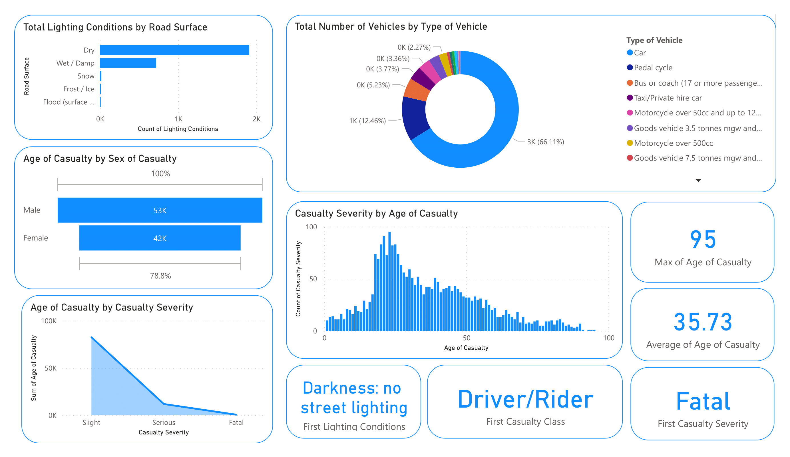

# Project 1: Accident Analysis

Accident analysis using the PowerBI tool aimed to analyze the relationship between casualty severity and different factors or conditions within the time and place of the accidents. The dataset was collected from the Kaggle website and comprises relevant attributes such as accident date, road class, lighting conditions, weather conditions, casualty severity, sex, age, and type of vehicle.  

