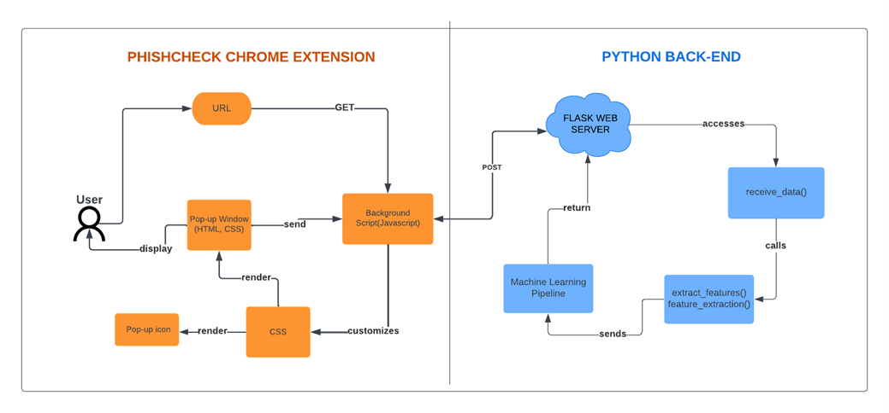
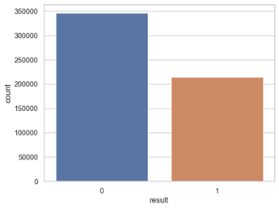
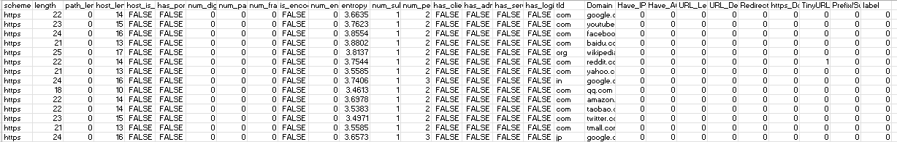

# My-Portfolio
Eden Rose Nate | Bicol University | BSCS 
# Project 1: PHISHCHECK: A BROWSER-BASED EXTENSION FOR PHISHING ATTACK DETECTION USING MACHINE LEARNING APPROACH <br />
## Project Overview
*Collected large dataset from multiple resources including Phishtank,OpenPhish and Kaggle.<br />
*Discovered the phishing anomaly using supervised algorithms such as Random Forest, SVM and XGBoost in terms of accuracy, precision, recall, f-measure and confusion matrix.<br />
*Identified the characteristics of phishing URLs.<br />
*Developed a browser-based extension that shall automatically categorize each URL as legitimate or phishing.

## Architectural Paradigm of the Study
This project used two important components further understand the cycle: the PhishCheck Chrome extension, which serves as the front-end, and Python, which serves as the study's back-end. Front-end components such as pop-up window and background scripts are some of the important parts of chrome extensions that were navigated first when users visit a website or enter a url in the pop-up address bar. <br />



# Data Preparation
The study's data preparation is divided into two parts: data preprocessing and feature engineering.
## A. Data Preprocessing 
The researchers used Python programming which uses libraries such as numpy, pandas, matplotlib and seaborn for the data preprocessing. Initially, the researchers combined all of the data cleaning into a single piece of code. After reviewing the dataset, it was discovered that there were numerous errors, including additional white spaces, null values, unnecessary columns, and duplicates. To further clean the dataset, the researchers concluded that these noises must be removed at each stage. 

### Import the libraries and collected raw data for checking and data cleaning. 
```
import pandas as pd
import numpy as np
import seaborn as sns
import matplotlib.pyplot as plt

#Import data
data = pd.read_csv(r"C:\Users\user\OneDrive\Desktop\Thesis1_Phishing\cleaned_finaldataset.csv")
data.head() 

#Displays the raw dataset
sns.set_theme(style="whitegrid")
sns.countplot(x=data["label"])
```


*Based on the figure above, the raw dataset is composed of 594,907 URLs. A total of 345, 738 legitimate URLs were taken from Kaggle and labeled as 0 while 249, 169 phishing URLs labeled as 1 were taken from Phishtank, Openphish and Kaggle. *

```
#counts the values in label column 
data['label'].value_counts()

def initial_read(data):
    print('SHAPE')
    print(data.shape)
    print('=====')
    print('DTYPES')
    print(data.dtypes)
    print('=====')
    print('NULL VALUES')
    print(data.isnull().sum())
    print('=====')

#Displays the dataframe
initial_read(data)

#Replace missing data with the most frequent occurences 
data1 = data.fillna(data.mode().iloc[0])
data1.count

# Check for and handle duplicates
data1.drop_duplicates(inplace=True)
```
### Exports the cleaned dataset 
```
#Saves the dataframe to CSV file
data1.to_csv(r'C:\Users\user\OneDrive\Desktop\Thesis1_Phishing\cleaned_finaldataset1.csv', index=False)
```

## B. Feature Engineering

Feature engineering or feature extraction is a process of dimensionality reduction where the researcher take a set of data and transform it into a set of features that are easier to work with. In other words, this is the process of selecting and transforming the most pertinent variables from raw data when developing a prediction model using statistical modeling or machine learning. 

```
from math import log
from re import compile
from urllib.parse import urlparse
from socket import gethostbyname
from requests import get
from json import dump
from string import ascii_lowercase
from numpy import array


class LexicalURLFeature:
    def __init__(self, url):
        self.description = 'blah'
        self.url = url
        self.urlparse = urlparse(self.url)
        self.host = self.__get_ip()


    def __get_entropy(self, text):
        text = text.lower()
        probs = [text.count(c) / len(text) for c in set(text)]
        entropy = -sum([p * log(p) / log(2.0) for p in probs])
        return entropy

    def __get_ip(self):
        try:
            ip = self.urlparse.netloc if self.url_host_is_ip() else gethostbyname(self.urlparse.netloc)
            return ip
        except:
            return None

    # extract lexical features
    def url_scheme(self):
        print(self.url)
        print(self.urlparse)
        return self.urlparse.scheme

    def url_length(self):
        return len(self.url)

    def url_path_length(self):
        return len(self.urlparse.path)

    def url_host_length(self):
        return len(self.urlparse.netloc)

    def url_host_is_ip(self):
        host = self.urlparse.netloc
        pattern = compile("^\d{1,3}\.\d{1,3}\.\d{1,3}\.\d{1,3}$")
        match = pattern.match(host)
        return match is not None

    def url_has_port_in_string(self):
        has_port = self.urlparse.netloc.split(':')
        return len(has_port) > 1 and has_port[-1].isdigit()

    def number_of_digits(self):
        digits = [i for i in self.url if i.isdigit()]
        return len(digits)

    def number_of_parameters(self):
        params = self.urlparse.query
        return 0 if params == '' else len(params.split('&'))

    def number_of_fragments(self):
        frags = self.urlparse.fragment
        return len(frags.split('#')) - 1 if frags == '' else 0

    def is_encoded(self):
        return '%' in self.url.lower()

    def num_encoded_char(self):
        encs = [i for i in self.url if i == '%']
        return len(encs)

    def url_string_entropy(self):
        return self.__get_entropy(self.url)

    def number_of_subdirectories(self):
        d = self.urlparse.path.split('/')
        return len(d)

    def number_of_periods(self):
        periods = [i for i in self.url if i == '.']
        return len(periods)

    def has_client_in_string(self):
        return 'client' in self.url.lower()

    def has_admin_in_string(self):
        return 'admin' in self.url.lower()

    def has_server_in_string(self):
        return 'server' in self.url.lower()

    def has_login_in_string(self):
        return 'login' in self.url.lower()
        
    def get_tld(self):
      return self.urlparse.netloc.split('.')[-1].split(':')[0]
import csv
import time

# Start the timer
start_time = time.time()

# read the csv dataset into a list of dictionaries
urls = []
with open(r"C:\Users\Ralph\Documents\BSCS-4B\Thesis\Feature Engineering\Dataset\Cleaned Data\Cleaned Dataset.csv", encoding='utf-8') as f:
    reader = csv.DictReader(f)
    for row in reader:
        urls.append(row)

# extract features from each URL
features = []
for url in urls:
    lexical_features = LexicalURLFeature(url['url'])
    url_features = {
        'scheme': lexical_features.url_scheme(),
        'length': lexical_features.url_length(),
        'path_length': lexical_features.url_path_length(),
        'host_length': lexical_features.url_host_length(),
        'host_is_ip': lexical_features.url_host_is_ip(),
        'has_port': lexical_features.url_has_port_in_string(),
        'num_digits': lexical_features.number_of_digits(),
        'num_params': lexical_features.number_of_parameters(),
        'num_frags': lexical_features.number_of_fragments(),
        'is_encoded': lexical_features.is_encoded(),
        'num_enc_chars': lexical_features.num_encoded_char(),
        'entropy': lexical_features.url_string_entropy(),
        'num_subdirs': lexical_features.number_of_subdirectories(),
        'num_periods': lexical_features.number_of_periods(),
        'has_client': lexical_features.has_client_in_string(),
        'has_admin': lexical_features.has_admin_in_string(),
        'has_server': lexical_features.has_server_in_string(),
        'has_login': lexical_features.has_login_in_string(),
        'tld': lexical_features.get_tld()
    }
    features.append(url_features)

# save the extracted features to a new csv file
fieldnames = ['scheme', 'length', 'path_length', 'host_length', 'host_is_ip', 'has_port', 'num_digits', 'num_params',
              'num_frags', 'is_encoded', 'num_enc_chars', 'entropy', 'num_subdirs', 'num_periods', 'has_client',
              'has_admin', 'has_server', 'has_login', 'tld']
with open('Dataset Features.csv', 'w', newline='') as f:
    writer = csv.DictWriter(f, fieldnames=fieldnames)
    writer.writeheader()
    for feature in features:
        writer.writerow(feature)

```
The code outputs the 29 extracted features from the raw dataset which are used for model training. 


*Feature engineering stage was divided into three types: URL-based features, Address bar based Feature and Lexical-based Feature. *

### URL-based Features
The features extracted from a URL are used to determine whether the URL is phishing or not. The quality of training data, and thus the quality of features fed into the model, determines the success of any learning effort. Thus, researchers must ensure that the extracted features represent or have the potential to identify the problem that they are attempting to model. The two sources of information used in extracting features are Address Bar based Features and Lexical based Features. 

### Address Bar based Features 
The address bar-based features are extracted from a URL inputted in the address bar and extracts the specific features of an URL based on its characteristics or structure. 

### Lexical-based Feature
These refer to statistical features extracted from the literal URL string. For example, length of the URL string, number of digits, and number of parameters in its query part, if the URL is encoded. (Ikwu, 2022). The following features presented below are the important extracted lexical-based features from the URL string which shall be used in the study.


