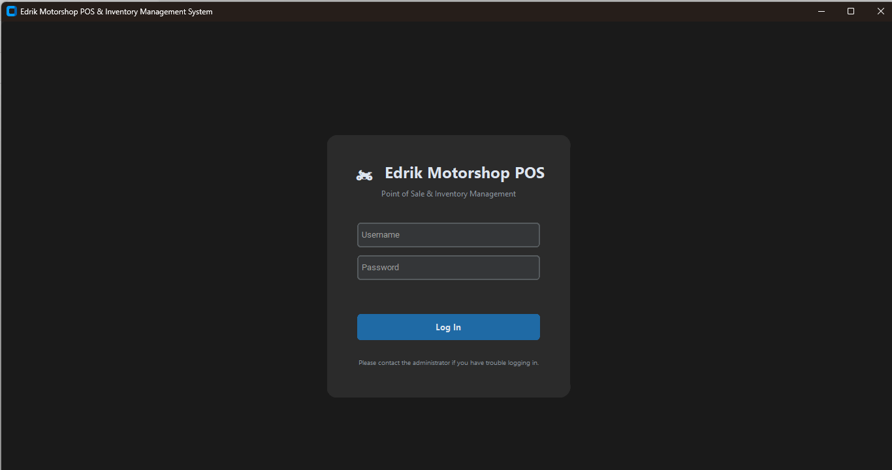
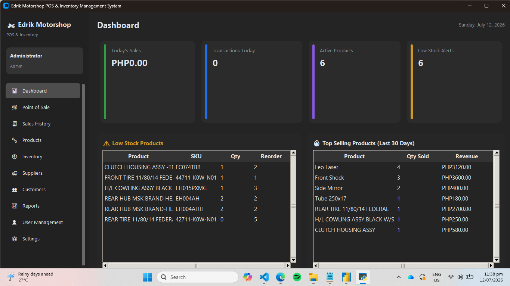
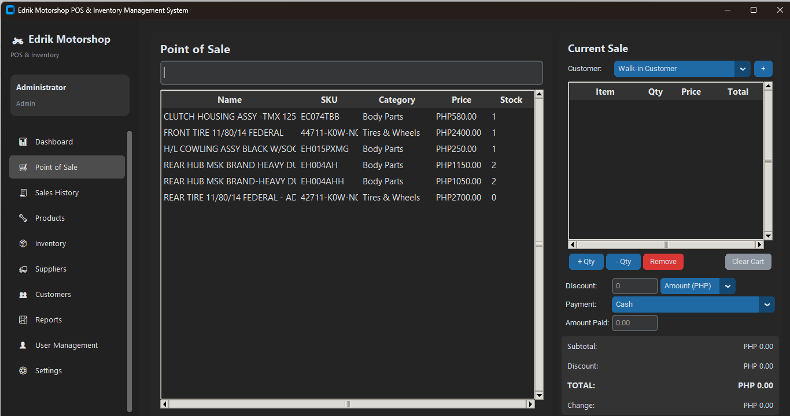
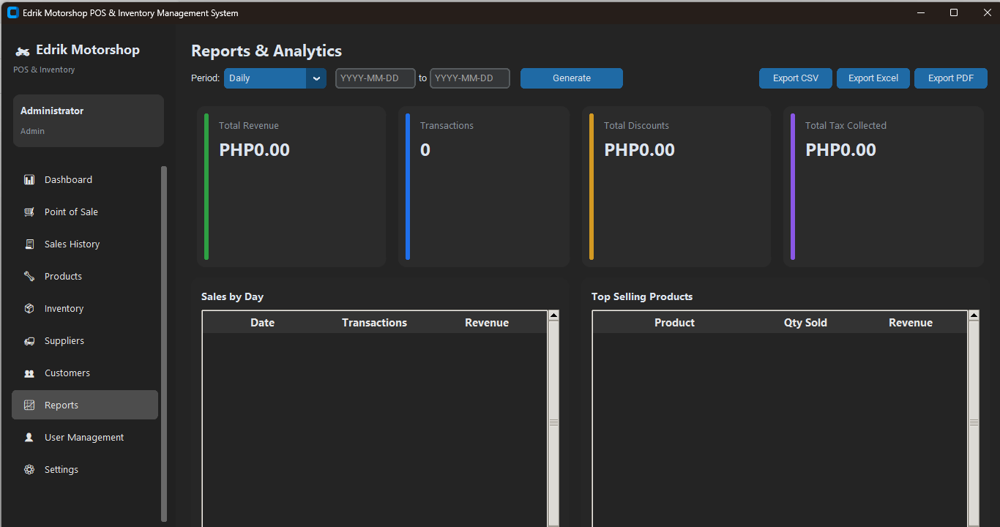
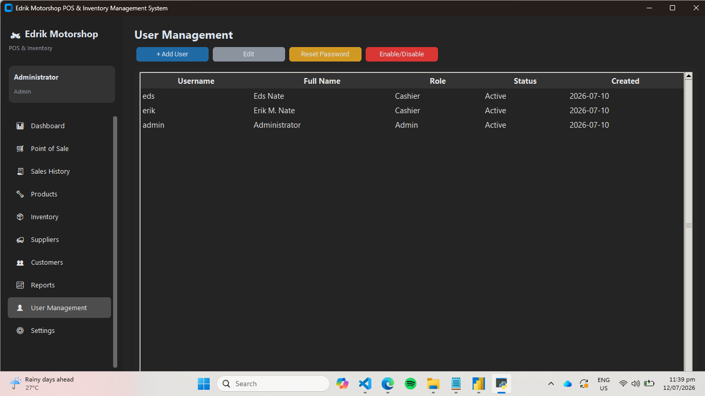

# 🏍️ Edrik Motorshop — POS & Inventory Management System

A desktop **Point of Sale (POS) and Inventory Management System** built for our family business. Fully offline, single-file SQLite backend, role-based access for admins and cashiers, and a modern dark-themed UI built with `customtkinter`.


---

## 📖 Overview

Edrik Motorshop POS is a **fully offline** desktop application designed to replace manual, paper-based sales and stock tracking with a fast, reliable, and modern digital system — no internet connection or cloud subscription required.

It handles the full daily workflow of a small retail shop: logging cashiers in, ringing up sales at the counter, tracking stock levels in real time, managing suppliers and customers, and giving the owner/admin visibility into performance through dashboards and exportable reports.

> 📌 **Portfolio note:** This project was built to demonstrate desktop application architecture, database design, role-based access control, and building a real, business-usable tool from scratch — not just a UI mockup.

---

## ✨ Key Features

### 🔐 Authentication & Roles
- Secure login screen with salted/hashed password verification
- Two roles — **Admin** and **Cashier** — each with a different set of accessible modules
- Accounts can be disabled without deleting sales history tied to them

### 📊 Dashboard
- Live "Today's Sales" and "Transactions Today" stat cards
- Active product count and low-stock alert count at a glance
- Low-stock product table with reorder levels
- Top-selling products for the last 30 days
- One-click refresh

### 🛒 Point of Sale (POS)
- Barcode scanner and manual SKU/name search with live filtering
- Add items to cart via barcode scan or double-click
- Adjustable quantity per line item with stock-level validation (can't oversell)
- Walk-in or registered customer selection, with a quick "add customer" shortcut mid-sale
- Discounts by fixed amount or percentage
- Automatic tax calculation based on configurable tax rate
- Multiple payment methods: Cash, GCash, Card, Bank Transfer
- Real-time subtotal / discount / tax / total / change computation
- Change-due validation (blocks checkout if cash tendered is insufficient)
- Auto-generated invoice numbers
- Optional receipt/invoice printing (PDF generation + print) immediately after checkout

### 🧾 Sales History
- Full transaction log, filterable by date range (Today / Week / Month / Year / All-time) and searchable by invoice number or customer
- Cashiers only see their own transactions; admins see all
- Detailed invoice viewer showing line items, totals, payment method, and cashier
- Reprint any past invoice on demand

### 🔧 Products Management (Admin)
- Full CRUD for products: SKU, barcode, name, category, supplier, cost price, selling price, stock quantity, reorder level, unit of measure, description
- Search by name/SKU/barcode, filter by category, filter to low-stock items only
- Soft-deactivate products (removes from POS while preserving historical sales data)

### 📦 Inventory Management (Admin)
- **Stock Levels tab:** live view of current quantity vs. reorder level with OK/LOW STOCK status
- **Adjustment History tab:** full audit trail of every stock change
- Manual stock adjustments with typed reasons: Stock In, Stock Out, Correction, Damaged/Lost, Returned by Customer
- Every adjustment is attributed to the logged-in user and timestamped

### 🚚 Suppliers & 👥 Customers
- Full CRUD directories for suppliers (contact person, phone, email, address) and customers
- Searchable tables, inline add/edit/delete
- Customers can also be added on-the-fly directly from the POS screen

### 📈 Reports & Analytics (Admin)
- Configurable reporting periods: Daily, Weekly, Monthly, Yearly, or a Custom Range
- Summary cards: Total Revenue, Transactions, Total Discounts, Total Tax Collected
- Sales-by-day breakdown table
- Top-selling products table
- **Export reports to CSV, Excel (.xlsx), or PDF**

### ⚙️ Settings (Admin)
- **Store Info:** store name, address, phone, email, currency symbol, tax rate, invoice number prefix, low-stock threshold, receipt footer message
- **Categories:** add/delete product categories
- **Backup & Restore:** one-click database backup, restore from a previous `.db` backup file, with a visible backup history list
- **Export Data:** export the entire product/inventory list to CSV, Excel, or PDF

### 👤 User Management (Admin)
- Create cashier/admin accounts
- Edit full name and role
- Reset a user's password
- Enable/disable accounts (self-disable is blocked as a safety guard)

---

## 🖼️ Screenshots

> Screenshots go here — add exported `.png` images to a `/screenshots` folder in your repo and reference them below.

| Login |
|---|---|
| |

| Dashboard
|---|---|
| |

| Point of Sale 
|---|---|
| |

| Reports |
|---|---|
| |

| User Management |
|---|---|
| |

<!--
Suggested screenshots to capture and add:
1. Login screen
2. Dashboard with stat cards + low stock panel
3. POS screen mid-sale (cart populated)
4. Products list with the Add Product dialog open
5. Inventory > Stock Levels tab
6. Inventory > Adjustment History tab
7. Reports screen with charts/tables populated
8. Settings > Store Info tab
9. User Management screen
10. A generated PDF invoice/receipt
-->

---

## 🏗️ Tech Stack

| Layer | Technology |
|---|---|
| Language | Python 3 |
| GUI Framework | [CustomTkinter](https://github.com/TomSchimansky/CustomTkinter) (built on Tkinter) |
| Database | SQLite (local, file-based, zero-config) |
| Reporting/Export | CSV, Excel (.xlsx), and PDF export utilities |
| Printing | PDF invoice generation with print dispatch |
| Architecture | Modular MVC-style structure — one module per feature, shared `Database` service layer, shared reusable widget library |

---

## 📂 Project Structure

```
edrik-motorshop-pos/
├── main.py                     # App entry point, shell/navigation, role-based menu
├── database/
│   └── db.py                   # SQLite database layer (queries, schema, auth helpers)
├── core/
│   ├── print_utils.py          # Invoice/receipt PDF generation + printing
│   ├── export_utils.py         # CSV / Excel / PDF export helpers
│   └── backup.py                # Database backup & restore utilities
├── ui/
│   ├── login_window.py         # Login screen
│   ├── dashboard_module.py     # Dashboard (stat cards, low stock, top products)
│   ├── pos_module.py           # Point of Sale / checkout screen
│   ├── products_module.py      # Product catalog CRUD
│   ├── inventory_module.py     # Stock levels & adjustment history
│   ├── suppliers_module.py     # Supplier directory CRUD
│   ├── customers_module.py     # Customer directory CRUD
│   ├── sales_module.py         # Sales history & invoice viewer
│   ├── reports_module.py       # Analytics & report exports
│   ├── settings_module.py      # Store info, categories, backup, export
│   ├── users_module.py         # User/account management
│   └── widgets.py              # Shared UI components (Table, StatCard, dialogs, etc.)
└── exports/                     # Default output folder for generated reports/backups
```

---

## 🚀 Getting Started

### Prerequisites
- Python 3.10 or later
- pip

### Installation

```bash
# Clone the repository
git clone https://github.com/<your-username>/edrik-motorshop-pos.git
cd edrik-motorshop-pos

# (Recommended) create a virtual environment
python -m venv venv
source venv/bin/activate      # Windows: venv\Scripts\activate

# Install dependencies
pip install -r requirements.txt
```

### Run the app

```bash
python main.py
```

On first launch the app initializes its local SQLite database automatically. Log in with your admin credentials to begin.

---

## 🔑 Role Permissions

| Module | Admin | Cashier |
|---|:---:|:---:|
| Dashboard | ✅ | ✅ |
| Point of Sale | ✅ | ✅ |
| Sales History | ✅ | ✅ (own sales only) |
| Products | ✅ | ❌ |
| Inventory | ✅ | ❌ |
| Suppliers | ✅ | ❌ |
| Customers | ✅ | ✅ |
| Reports | ✅ | ❌ |
| User Management | ✅ | ❌ |
| Settings | ✅ | ❌ |

---

## 🗺️ Roadmap / Ideas for Future Improvement

- [ ] Multi-branch / multi-terminal support with sync
- [ ] Purchase order management tied to suppliers
- [ ] Barcode label printing
- [ ] Charts/graphs in the Reports module (currently table-based)
- [ ] Automated scheduled backups

---

## 👤 Author

Built by **Eden Rose Nate** — [GitHub](https://github.com/nate1100) · [Portfolio](https://nate1100.github.io/)
